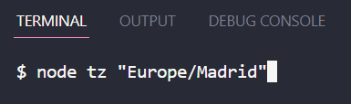
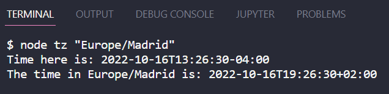
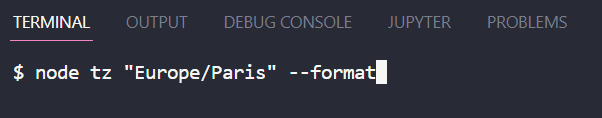
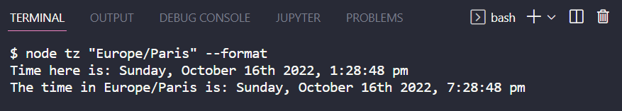

# Timezone Utility

This utility returns the current time at any city in the world!!

## Instructions:

Initialize node and the name of the utility followed by the timezone of interest in double quotations.

`node tz "<timezone>"`

The timezone format is the continent followed by the city of interest:

`"Continent/City_Of_Interest"

*Make sure to type the tz correctly*

Here is how it should look:

This should return:

To format the timezone, there's an optional **--format** flag that does exactly that! You can add this flag *after* the timezone.

This should return:

